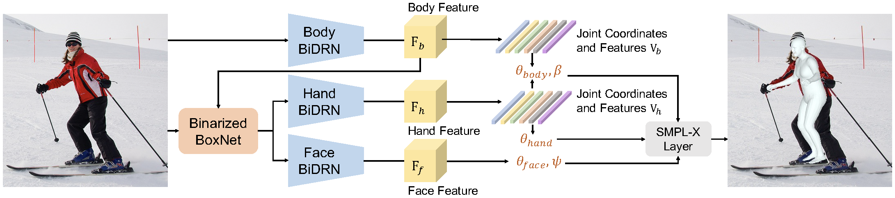
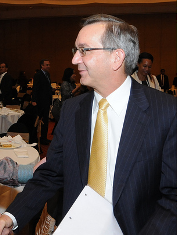
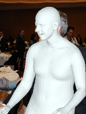
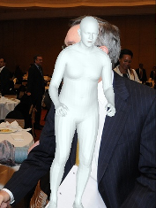
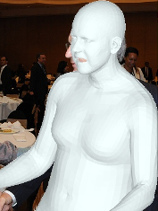
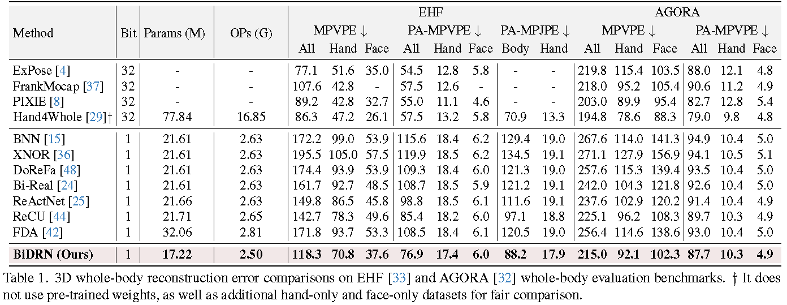
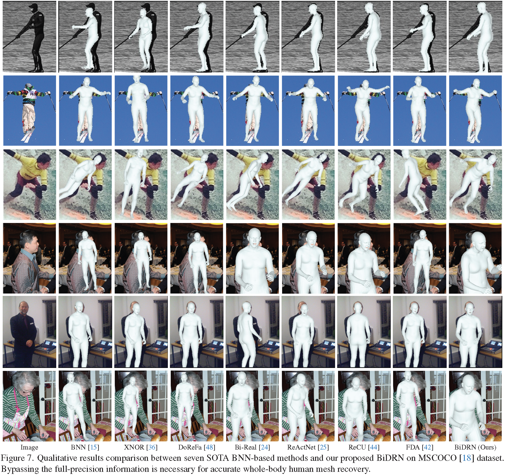

# BiDRN: Binarized Dual Residual Network for 3D Whole-body Human Mesh Recovery

Zhiteng Li, [Yulun Zhang](http://yulunzhang.com/), [Jing Lin](https://jinglin7.github.io), [Haotong Qin](https://htqin.github.io/), [Jinjin Gu](https://www.jasongt.com/), [Xin Yuan](https://en.westlake.edu.cn/faculty/xin-yuan.html), [Linghe Kong](https://www.cs.sjtu.edu.cn/~linghe.kong/), and [Xiaokang Yang](https://scholar.google.com/citations?user=yDEavdMAAAAJ), "Binarized 3D Whole-body Human Mesh Recovery", arXiv, 2023

[[arXiv](https://arxiv.org/pdf/2311.14323.pdf)] [[supplementary material](https://github.com/ZHITENGLI/BiDRN/releases/tag/v1)] [visual results] [pretrained models]

> **Abstract:** 3D whole-body human mesh recovery aims to reconstruct the 3D human body, face, and hands from a single image. Although powerful deep learning models have achieved accurate estimation in this task, they require enormous memory and computational resources. Consequently, these methods can hardly be deployed on resource-limited edge devices. In this work, we propose a Binarized Dual Residual Network (BiDRN), a novel quantization method to estimate the 3D human body, face, and hands parameters efficiently. Specifically, we design a basic unit Binarized Dual Residual Block (BiDRB) composed of Local Convolution Residual (LCR) and Block Residual (BR), which can preserve full-precision information as much as possible. For LCR, we generalize it to four kinds of convolutional modules so that full-precision information can be propagated even between mismatched dimensions. We also binarize the face and hands box-prediction network as Binaried BoxNet, which can further reduce the model redundancy. Comprehensive quantitative and qualitative experiments demonstrate the effectiveness of BiDRN, which has a significant improvement over state-of-the-art binarization algorithms. Moreover, our proposed BiDRN achieves comparable performance with full-precision method Hand4Whole while using just **22.1%** parameters and **14.8%** operations. We will release all the code and pretrained models. 



---

|                     Image                     |                       [Hand4Whole](https://github.com/mks0601/Hand4Whole_RELEASE)<br>(full-precision)                        | BNN |                 BiDRN (ours)                  |
| :----------------------------------------: | :---------------------------------------------: | :----------------------------------------------: | :-----------------------------------------: |
|  |  |    |  |
| Params(M) / OPs (G) | 77.84 / 16.85 | 21.61 / 2.63 | **17.22 / 2.50** |


## ⚒️ TODO

* [ ] Complete this repository

## 🔗 Contents

- [ ] Datasets
- [ ] Training
- [ ] Testing
- [x] [Results](#Results)
- [x] [Citation](#Citation)
- [x] [Acknowledgements](#Acknowledgements)

## 🔎 Results

We outperform existing state-of-the-art BNN-based methods and even achieve comparable performance with full-precision methods. More results can be found in the paper.


Quantitative Comparison


- results in Table 1 of the main paper

<p align="center">
  
</p>


Visual Comparison


- results in Figure 7 of the main paper

<p align="center">
  
</p>

## Citation

If you find the code helpful in your research or work, please cite the following paper(s).

```
@article{li2023binarized,
      title={Binarized 3D Whole-body Human Mesh Recovery}, 
      author={Zhiteng Li and Yulun Zhang and Jing Lin and Haotong Qin and Jinjin Gu and Xin Yuan and Linghe Kong and Xiaokang Yang},
      year={2023},
      eprint={2311.14323},
      archivePrefix={arXiv},
      primaryClass={cs.CV}
}
```


## 💡 Acknowledgements

This work is released under the Apache 2.0 license.
The codes are based on [Hand4Whole](https://github.com/mks0601/Hand4Whole_RELEASE). Please also follow their licenses. Thanks for their awesome works.
